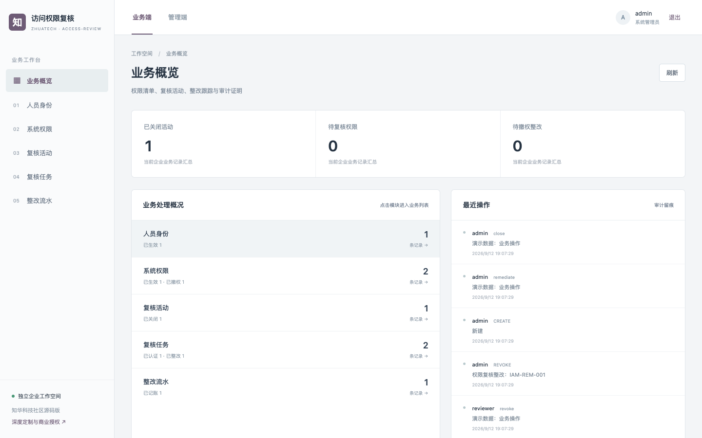
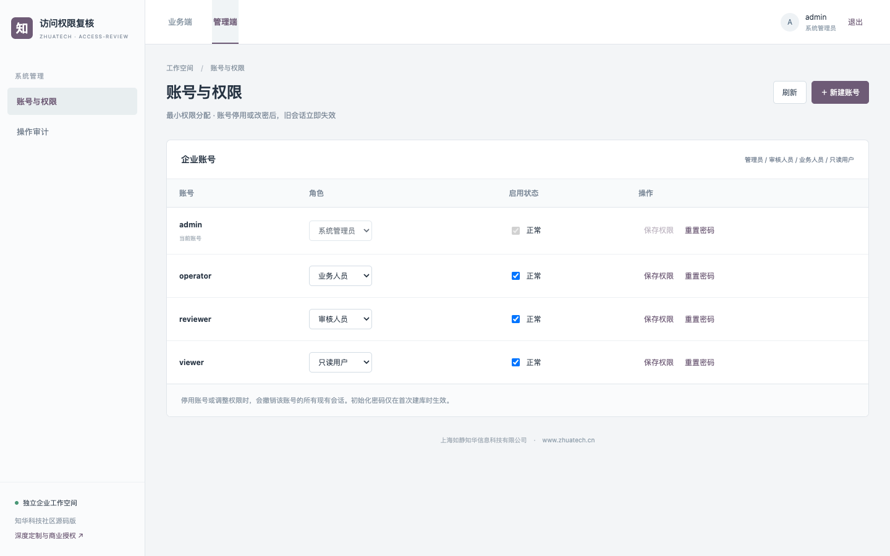
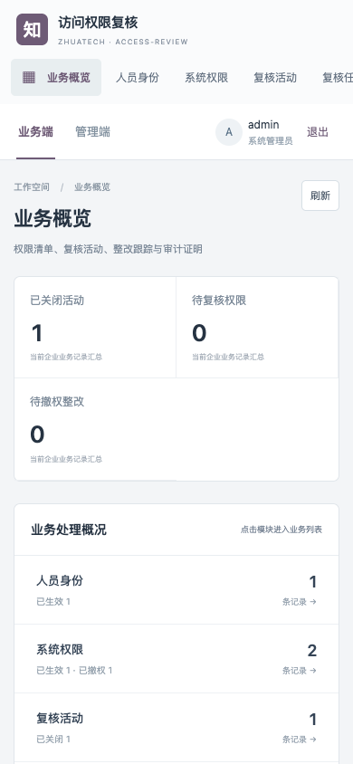

# 知华访问权限复核

`zhuatech-access-review` 是上海如静知华信息科技有限公司面向企业 IAM/内控团队的权限复核源码版。通过真实的权限快照、人员决策和整改闭环，让一次季度复核有完整证据链。官网：[知华科技](https://www.zhuatech.cn/)。

## 一次复核如何完成

1. 建立员工身份与系统权限，校验员工编号及有效授权的唯一性。
2. 发起指定系统或 `ALL` 范围的复核活动，系统自动为有效权限生成逐项复核任务。
3. 审核人员对每项权限选择“保留”或“撤销”，写明理由；提交人不能自审。
4. 对撤销项，由执行人员关联工单完成实际撤权，权限状态改为 `REVOKED` 并生成整改流水。
5. 所有任务已认证或已整改后，管理员方能关闭活动；待处理项会阻止关闭。

## 企业控制点

| 控制点 | 当前实现 |
| --- | --- |
| 范围固定 | 活动启动时记录权限快照及任务数，后续不能静默删减。 |
| 职责分离 | 决策和执行使用不同角色/操作者，用户管理变更撤销旧会话。 |
| 不可直接造流水 | 复核项与整改记录由业务动作生成，不能手工创建或编辑。 |
| 审计可追溯 | 操作前后快照、操作者、说明、时间和版本进入审计表。 |



管理端账号与权限设置：



移动 H5 工作台：



本版的“实际撤权”是本系统内权限台账的状态变更；连接企业 AD、LDAP、云 IAM 或 SaaS 权限接口时，还须实施执行结果回读与对账，不应仅凭本系统状态声称外部系统已经撤权。

## 运行与验证

需要 Docker Compose。复制 `.env.example` 为 `.env`，分别设置 MySQL 与四种角色的独立强密码，然后执行：

```bash
docker compose up -d --build
sh scripts/test.sh
```

业务端与管理端共用 `http://127.0.0.1:8088`（管理入口 `/admin`）；后端健康检查为 `http://127.0.0.1:18080/api/health`。四个初始化账号为 `admin`、`reviewer`、`operator`、`viewer`，密码从环境变量读取。端口可通过 `WEB_PORT`、`API_PORT` 调整。可使用 `.env.demo.example` 做**仅本机**演示，但切勿连接真实业务数据库或向公网开放演示密码。

后端采用 Java 21 / Spring Boot 4 / MySQL 8.4 / Flyway；前端采用 Vue 3 / Vite，适配桌面与 H5。CI 在 MySQL 上运行后端测试；本机脚本默认用 H2 MySQL 兼容模式跑后端验收，再跑前端单测及生产构建。完整验收脚本见 `backend/src/test/resources/acceptance.json`。

## 使用边界与授权

本仓库是可运行的公开源码学习交流版本，**不是 OSI 意义的开源许可**。根据 [LICENSE](LICENSE)，源码仅限个人非商业学习、研究和交流。企业内部生产、客户交付、SaaS、收费服务及其他商用均须先取得上海如静知华信息科技有限公司书面授权。生产上线还需要企业自己的安全评估、备份恢复、合规与业务参数验收。

[知华科技官网](https://www.zhuatech.cn/)提供中小企业信息化、AI 转型、OPC 技术支持、软件项目外包、实施、FDE 外包与深度开发定制咨询。也可扫码添加微信咨询：

| 微信咨询一 | 微信咨询二 |
| --- | --- |
|  |  |

版权及项目维护：上海如静知华信息科技有限公司 · https://www.zhuatech.cn/
